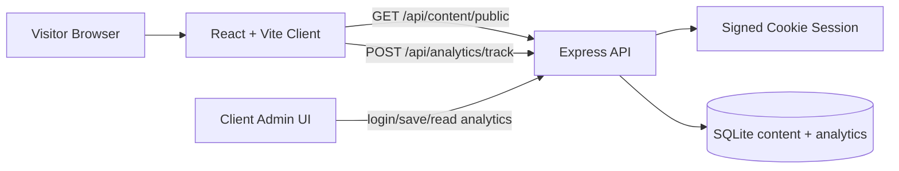
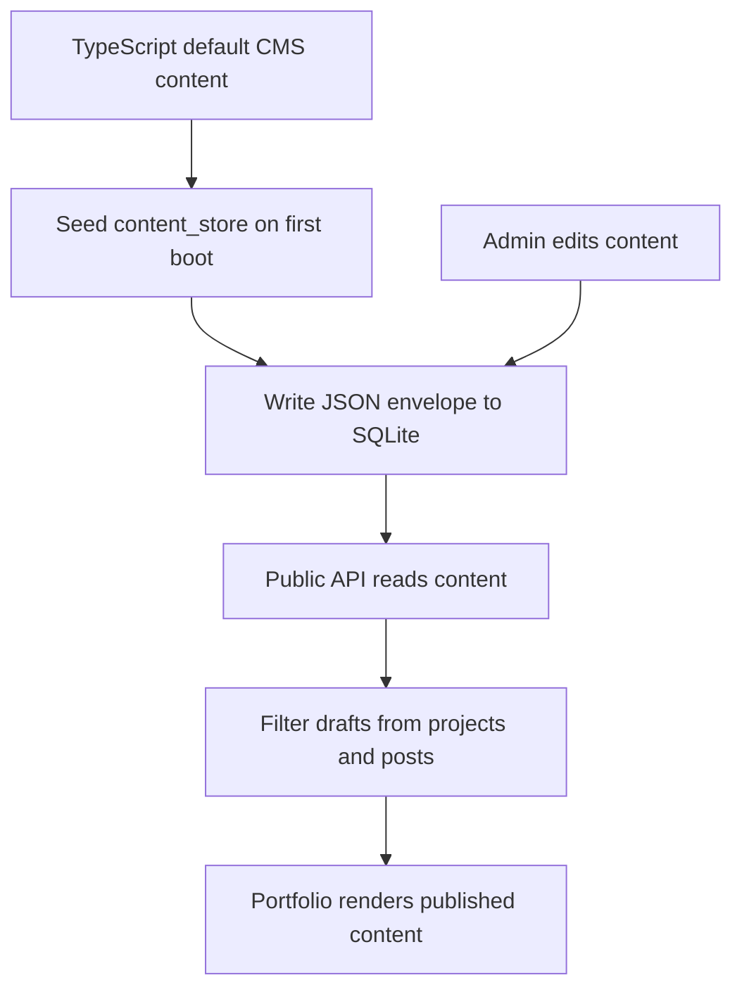

# Portfolio Client

Production-ready portfolio platform built with React, Vite, TypeScript, Express, and SQLite.

This project is not a static template. It ships as a small full-stack app with:

- a public portfolio site
- a protected `/admin` CMS for the client
- draft vs published content visibility
- built-in analytics for page views and key actions
- a lightweight SQLite-backed content store

## Contents

- [Overview](#overview)
- [Core capabilities](#core-capabilities)
- [Architecture](#architecture)
- [Tech stack](#tech-stack)
- [Project structure](#project-structure)
- [How content works](#how-content-works)
- [Authentication model](#authentication-model)
- [Analytics model](#analytics-model)
- [Routes](#routes)
- [API surface](#api-surface)
- [Environment variables](#environment-variables)
- [Local development](#local-development)
- [Build and deployment](#build-and-deployment)
- [Verification](#verification)

## Overview

The app has two sides:

1. A public-facing portfolio with case studies, journal content, contact flow, and marketing pages.
2. A private client-only admin area where content, projects, posts, and site settings can be edited.

The frontend consumes CMS data through `/api/content/public`.  
The admin area uses authenticated endpoints under `/api/admin/*`.  
Content is stored as JSON in SQLite and seeded automatically from the TypeScript defaults on first run.

## Core capabilities

- Public portfolio pages backed by a CMS content layer
- Protected `/admin` editor for site settings, homepage sections, page copy, projects, and journal posts
- Draft/published support so visitors never see unpublished work
- Analytics dashboard with visitor counts, page views, tracked actions, and recent events
- Lazy-loaded page routes and split production bundles
- Server-rendered static asset delivery in production through Express

## Architecture

### High-level system



### Content lifecycle



### Request model

- Public visitors can only read published content.
- Admin users authenticate through `/api/auth/login`.
- Authenticated admin requests use a signed `httpOnly` cookie.
- Analytics are collected anonymously using a client-side generated session ID stored in localStorage.

## Tech stack

### Frontend

- React 19
- React Router 7
- TypeScript
- Vite 6
- Tailwind CSS 4
- `motion`
- `react-markdown`
- `lucide-react`

### Backend

- Express 4
- `better-sqlite3`
- `dotenv`
- custom signed-cookie auth

### Tooling

- ESLint
- TypeScript type-checking
- `tsx`
- `concurrently`

## Project structure

```text
.
|-- public/
|   |-- favicon.svg
|   |-- robots.txt
|   `-- site.webmanifest
|-- server/
|   |-- analytics-store.ts
|   |-- auth.ts
|   |-- config.ts
|   |-- content-store.ts
|   |-- database.ts
|   `-- index.ts
|-- src/
|   |-- analytics/
|   |-- cms/
|   |-- components/
|   |-- features/
|   |   |-- admin/
|   |   |-- contact/
|   |   |-- home/
|   |   |-- journal/
|   |   `-- projects/
|   |-- hooks/
|   |-- pages/
|   |-- App.tsx
|   |-- index.css
|   `-- main.tsx
|-- .env.example
|-- package.json
|-- tsconfig.json
|-- tsconfig.server.json
`-- vite.config.ts
```

### Important modules

- [`src/App.tsx`](src/App.tsx): route registration and lazy page loading
- [`src/cms/CmsProvider.tsx`](src/cms/CmsProvider.tsx): client-side CMS state provider
- [`src/cms/schema.ts`](src/cms/schema.ts): shared content and analytics types
- [`server/index.ts`](server/index.ts): Express entrypoint and API routes
- [`server/content-store.ts`](server/content-store.ts): SQLite-backed content storage
- [`server/analytics-store.ts`](server/analytics-store.ts): analytics persistence and snapshot aggregation
- [`server/auth.ts`](server/auth.ts): signed cookie auth helpers

## How content works

The CMS data model is composed of:

- `site`: global metadata, navigation, social links, contact methods, service options
- `home`: hero, stats, services, featured content, differentiators, process, testimonials, FAQ, final CTA
- `pages`: portfolio/about/contact/journal page copy
- `projects`: case studies with draft/published status
- `blogPosts`: journal posts with draft/published status

On first server boot:

1. The server creates the SQLite database file if it does not exist.
2. The `content_store` table is created if missing.
3. Default CMS content is seeded from the TypeScript defaults.

When public content is returned:

- projects are filtered to published only
- blog posts are filtered to published only

When admin content is returned:

- the full editable content set is returned, including drafts

## Authentication model

Admin access is available at `/admin`.

Authentication flow:

1. Admin submits username and password to `/api/auth/login`
2. Server validates credentials against the configured admin username and password hash
3. Server creates a revocable server-side session in SQLite
4. Server issues a hardened `httpOnly` session cookie
5. Authenticated requests can access `/api/admin/content` and `/api/admin/analytics`
6. Authenticated write requests must also include a valid CSRF token

Session details:

- cookie name: `aura_admin_session` in development and `__Host-aura_admin_session` in production
- cookie uses `sameSite=strict`
- `httpOnly`
- `secure` in production
- sessions are revoked on logout
- sessions enforce an absolute lifetime and an idle timeout
- sessions are bound to the browser user agent
- CSRF protection is enforced on authenticated mutations

Login and request hardening:

- repeated failed logins are rate-limited
- cross-site write requests are rejected by origin checks
- auth and admin responses are marked `Cache-Control: no-store`
- the server applies security headers such as `X-Frame-Options`, `X-Content-Type-Options`, HSTS in HTTPS production, and a restrictive baseline CSP for framing/object usage

## Analytics model

Analytics are intentionally lightweight and internal.

### What is tracked

- page views
- CTA clicks
- project opens
- portfolio filters
- journal filters
- journal pagination
- journal post opens
- contact method clicks
- inquiry submissions
- admin logins
- failed admin logins
- admin logouts
- admin content saves

### How it works

- The client creates an anonymous session ID and stores it in localStorage.
- Events are sent to `/api/analytics/track`.
- The server sanitizes and stores each event in SQLite.
- The admin dashboard reads a snapshot window and calculates:
  - total visitors
  - total page views
  - total actions
  - total inquiries
  - visits by day
  - top pages
  - action breakdown
  - recent events

Default analytics window: `14` days.

## Routes

### Public routes

- `/`
- `/portfolio`
- `/portfolio/:slug`
- `/journal`
- `/about`
- `/contact`

### Private route

- `/admin`

## API surface

### Auth

- `GET /api/auth/session`
- `POST /api/auth/login`
- `POST /api/auth/logout`

### Content

- `GET /api/content/public`
- `GET /api/admin/content`
- `PUT /api/admin/content`

### Analytics

- `POST /api/analytics/track`
- `GET /api/admin/analytics`

## Environment variables

Use the values in [.env.example](.env.example) as the starting point.

| Variable | Required | Purpose |
| --- | --- | --- |
| `ADMIN_USERNAME` | Yes | Username for `/admin` login |
| `ADMIN_PASSWORD` | Dev only | Plaintext fallback password for local development only |
| `ADMIN_PASSWORD_HASH` | Yes in production | Scrypt password hash for admin login |
| `SESSION_SECRET` | Yes | Secret used to hash session tokens and bind sessions securely |
| `APP_ORIGIN` | No | Primary allowed browser origin for authenticated admin writes |
| `ALLOWED_ORIGINS` | No | Comma-separated extra allowed origins for authenticated admin writes |
| `ADMIN_LOGIN_WINDOW_MINUTES` | No | Window used for login attempt counting |
| `ADMIN_LOGIN_BLOCK_MINUTES` | No | Temporary lockout duration after too many failed logins |
| `ADMIN_LOGIN_MAX_ATTEMPTS` | No | Maximum failed login attempts allowed within the window |
| `ADMIN_SESSION_DAYS` | No | Absolute admin session lifetime |
| `ADMIN_SESSION_IDLE_HOURS` | No | Idle timeout before an admin session expires |
| `CMS_DB_PATH` | No | Path to the SQLite database file |
| `PORT` | No | Express server port, defaults to `4000` |
| `VITE_API_BASE_URL` | No | Optional client API base URL, useful when frontend and backend are served from different origins |

## Local development

### Prerequisites

- Node.js 20+ recommended
- npm

### Install

```bash
npm install
```

### Configure environment

Create a local env file or set environment variables in your shell.

Example values:

```bash
ADMIN_USERNAME=client
ADMIN_PASSWORD_HASH=
SESSION_SECRET=replace-this-with-a-long-random-secret
APP_ORIGIN=
ALLOWED_ORIGINS=
ADMIN_LOGIN_WINDOW_MINUTES=15
ADMIN_LOGIN_BLOCK_MINUTES=30
ADMIN_LOGIN_MAX_ATTEMPTS=5
ADMIN_SESSION_DAYS=7
ADMIN_SESSION_IDLE_HOURS=12
CMS_DB_PATH=./data/cms.sqlite
PORT=4000
VITE_API_BASE_URL=
```

Generate a production password hash with:

```bash
npm run hash:password -- "your-strong-password"
```

### Start development

```bash
npm run dev
```

This starts:

- Vite client on `http://localhost:3000`
- Express API on `http://localhost:4000`

In development, Vite proxies `/api/*` requests to the Express server.

### Admin access

Open:

```text
http://localhost:3000/admin
```

Use the credentials from your environment variables.

## Available scripts

| Command | Purpose |
| --- | --- |
| `npm run dev` | Start client and server together |
| `npm run dev:client` | Start the Vite frontend |
| `npm run dev:server` | Start the Express server in watch mode |
| `npm run build` | Build the frontend bundle |
| `npm run preview` | Preview the production frontend bundle |
| `npm run start` | Start the Express server |
| `npm run hash:password -- "password"` | Generate a scrypt password hash for `ADMIN_PASSWORD_HASH` |
| `npm run typecheck` | Run client and server TypeScript checks |
| `npm run lint` | Run type-checking and ESLint |

## Build and deployment

This app is not static-only if you want the CMS/admin features.

To deploy the full system you need:

1. a Node-capable host
2. persistent storage for the SQLite database
3. environment variables for admin auth and session signing

### Production flow

```bash
npm install
npm run build
npm run start
```

### Deployment notes

- Keep the SQLite database file on persistent storage.
- Do not deploy with the example admin credentials.
- Use `ADMIN_PASSWORD_HASH` instead of `ADMIN_PASSWORD`.
- Set a strong `SESSION_SECRET`.
- Set `APP_ORIGIN` or `ALLOWED_ORIGINS` if admin writes can originate from another trusted origin.
- If frontend and backend are on different origins, set `VITE_API_BASE_URL`.
- Ensure the reverse proxy forwards cookies correctly.

## Verification

Current verification commands:

```bash
npm run lint
npm run build
```

Both should pass before deployment.

## Notes

- The database is created automatically at the configured `CMS_DB_PATH`.
- Public visitors are always read-only.
- Draft projects and draft journal posts are hidden from the public API.
- The admin area reads and writes live content directly through the server API.
